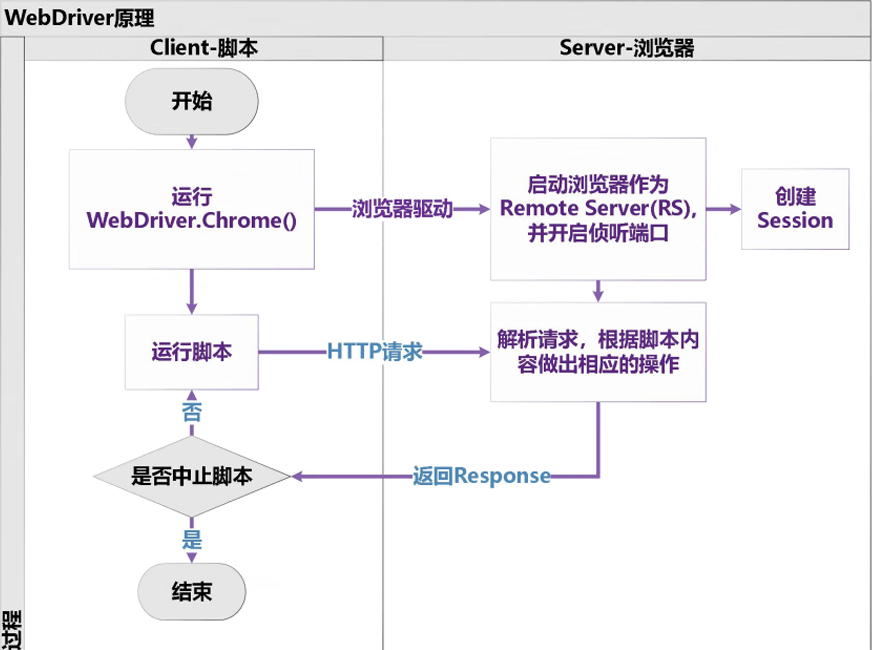
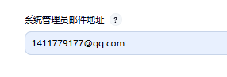
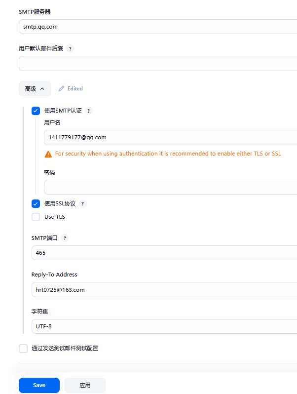
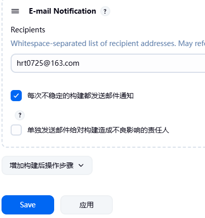

###### **自动化的流程**

* 确定目标：确定自动化的范围；
  * 新项目：前端部分（核心业务流）
  * 维护项目：稳定的业务（流程->功能）
* 自动化需求分析：分析适合开展自动化的流程和场景用例；
* 自动化方案选型：工具，框架的选择；选择适合团队的；
  * 考虑因素：成本（开源、付费），项目的架构（B/S，C/S）,人员的能力（代码编程，自己写，录制），编程语言（Python，Java）；
* 测试计划：自动化开展所需要的人力资源，时间周期，工作安排；
* 设计用例：从功能用例中挑选适合自动化的流程用例或场景用例；没有就单独设计；(Excel)
* 框架设计：自动化测试过程所需要的各种配置文件的设计，测试数据，测试用例，测试报告，测试组件等测试资源的规范统一；
* 脚本编写：根据测试用例，转换或编写对应的测试脚本；
* 环境搭建：测试过程中所需要的配套资源。代码编译工具IDE（PyCharm），Python的安装，项目的部署；
* 脚本执行：执行自动化测试脚本，单脚本的调试执行，单场景的验证，批量的迭代执行；
* 测试报告：对执行的结果进行分析，提交测试缺陷，总结测试报告；
* 脚本维护：对测试中存在的脚本问题，框架设计缺陷进行优化调整；

**测试需求分析->测试计划制定->测试用例设计->测试框架搭建->测试脚本编写->脚本执行->结果分析->测试报告**

###### **自动化测试工具**

* Selenium：开源，跨平台，跨浏览器，多编程语言；框架集成度高，生态丰富；支持B/S，不支持C/S，代码编程要求高；
* UET (QTP)：企业级付费，支持录制回放，支持B/S，C/S；付费，成本高；
* Robot Framework (RF)：关键字驱动，封装程度高，简单易用；不支持对代码底层的修改；
* Cypress：基于前端开发框架(Vue/React/Angular）的前端自动化，js/ts；只支持IS，多浏览需付费;
* Playwright：微软系，支持多浏览器，支持录制回放；兼容性比较差；

###### **自动化测试用例**

* 定义：从功能测试用例中挑选具有代表性的业务流程或功能场景，形成的测试用例；
* 自动化用例编写原则
  * 自动化用例是一个完整的场景，脚本编写要有始有终（从开始，到退出浏览器）；
  * 自动化用是证明功能可用的，主要由正向用例组成；避免使用逆向或异常用例；
  * 自动化测试用例相对独立，测试用例之间尽量减少相互依赖；
  * 测试用例执行完成要进行场景还原，避免干扰影响其他用例执行；
  * 测试用例要尽可能细化操作；

| 编号                 | 标题                              | 数据                                                                                              | 步骤                                                               | 预期           | 优先级 | 测试结果 |
| -------------------- | --------------------------------- | ------------------------------------------------------------------------------------------------- | ------------------------------------------------------------------ | -------------- | ------ | -------- |
| ECS_Flow_shopping_01 | 验证购物流程_单商品直接购买支付   | 用户名：tom<br />登录密码：123<br />关键字：华为手机<br />商品名称：华为Pro70<br />支付密码：1234 | 1.用户登录<br />2.搜索商品<br />3.选择商品立即购买<br />4.支付商品 | 与步骤一一对应 |        |          |
| ECS_Flow_shopping_02 | 验证购物流程_购物车中批量结算支付 |                                                                                                   |                                                                    |                |        |          |

###### **自动化测试架构方式**

* 线性架构：按照测试用例形成线性化的流程脚本，每个脚本对应一条测试用例；
  * 特点：脚本相对独立，执行度比较高；脚本复用性较差，维护成本比较高；
* 模块化驱动：对项目中重复使用的功能业务，封装成一个独立模块，方便在不同用例中调用；
  * 特点：业务模块化，减少代码的重复量，提高复用率；代码重复使用，执行用例时，相同的测试数据导致用例通过率较低；
* 数据驱动：在模块化驱动的基础上，将测试数据从脚本中分离出来，使用不同的参数化方式实现DDT；
  * 特点：测试数据和测试脚本进行数据分离，提供逻辑模块的复用率和用例执行率；需要重构业务，提升脚本编写的复杂度；
* 关键字驱动：通过对底层业务的封装，实现使用关键字对业务进行行为驱动，简化测试的代码复杂度；
  * 特点：高度封装底层逻辑，对外暴露关键行为，降低自动化门槛；不便于对底层进行自定义开发，无法实现个性化脚本自动化；

###### **自动化测试环境搭建**

* 安装Python：Python3.9+以上版本
* 安装Selenium：`pip install -U selenium` 更新安装
* 安装浏览及驱动：下载最新或稳定的Chrome/FireFox/Edge，及对应的驱动；配置环境变量（驱动放在Python路径）
* 编程工具IDE：PyCharm；
* 创建项目：项目名称和路径避免使用中文，Python解释器选择本地Python；

###### **环境问题解决**

* Python解释器冲突问题：
  * 存在多版本的Python，系统环境变量配置顺序不一致导致执行版本不一致；
  * 虚拟解释器和本地解释器，PyCharm 创建项目默认使用even虚拟解释，需更改为本地解释器；
* 浏览器与驱动冲突：浏览器版本与驱动版本不一致；推荐浏览器驱动及时检查，环境变量配置固定位置；
* Selenium版本更新：及时更新selenium

##### **Selenium 的使用**

###### **webdriver工作原理**

* 
* Webdriver是一个基于C/S架构的服务结构；脚本代码属于Client客户端，浏览器属于Server服务端；
* 客户端启动时实例化一个浏览器webdriver对象，通过The Webdriver Wire Protocal 协议驱动浏览器启动，创建Session会话，开启侦听端口，等待后续指令发送；
* 客户端脚本运行过程中，通过Http协议向服务端发送请求，服务端浏览器接收了请求后解析，并作出相应操作，将结果返回给客户端；
* 客户端脚本收到服务器返回的结果后，判断是否终止脚本，则继续向服务器浏览器发送请求，若没有，则结束；关闭session会话；

###### **元素的定位和操作**

###### **浏览器操作**

* 打开浏览器 `driver.get(url)`
* 关闭浏览器
  * 关闭当前窗口：driver.close()
  * 关闭浏览器：driver.quit()
* 浏览器最大化、最小化，全屏：
  * driver.maximize_window()
  * driver.minimize_window()
  * driver.fullscreen_window()
* 浏览器前进后退刷新
  * driver.back()
  * driver.forward()
  * driver.refresh()

###### **元素定位**

* By.ID
* By.NAME
* By.CLASS_NAME
* By.TAG_NAME
* By.LINK_TEXT
* By.PARTICAL_LINK_TEXT
* By.CSS_SELECTOR
* By.XPATH
* 浏览器F12检查元素
  * document.getElementById()/getElementbyName()
  * document.querySelector()
  * document.querySelectorAll()
* js的JQuery查询：$("")

###### **XPATH选择策略**

* 要求使用相对路径：`//*[@id="chat-submit-button"]`
* 通过@属性名称定位：`//button[@id="chat-submit-button"]`   #优先使用id，name,class属性，其他唯一属性；
* 属性值有多个: ` //textarea[@class="chat-input-textareachat-input-scroll-style"]`   #全部写
* 通过多个属性定位：
  * 使用and同时满足多个属性：`//a[@target="_blank" and @class="a3"]`
  * 使用or 满足任意属性：`//a[@target="blank" or @class="a3"]`
* 属性模糊匹配 `//a[contains(@class，'mnav＇)]`
* 标签文本模糊匹配  `//a[contains(text()，"地图")]`
* 通过直接父级定位：`//div[@id="s-top-left"]/a`
* 通过数字顺序定位：`//div[@id="head"]/div[3]/a`    #[3] 第三个标签
* 通过子级找父级 `//div[@id="head"]/`   #代表上级

###### **定位优先级**

id > name > class_name > css_selector > xpathr > link_text > partial_link_text > tag_name

###### **相对定位**

* 概念：通过参考元素来确定目标元素，
* 根据目标元素在参考元素的水平或垂直方位(上，下，左，右，附近)，像素级别的100px以内；
  * below：标元素在参考元素的垂直方向的下方；
  * above：标元素在参考元素的垂直方向的上方；
  * to_left_of：标元素在参考元素的水平方向的左边；
  * to_right_of：标元素在参考元素的水平方向的右边；
  * near：目标元素在参考元素的垂直或水平方向的附近；默认10px，可以指定；
* 示例：
  ```python
  #with_tag_name：目标元素的标签名
  driver.find_element(
      with_tag_name('textarea').near({By.ID: 'chat-input-area'})
  ).send_keys("pyton")
  #locate_with：目标元素的定位方式T
  driver.find_element(
      locate_with(By.TAG_NAME, 'textarea').near({By.ID: 'chat-input-area'})
  ).send_keys("pyton")
  #locate_with：目标元素的定位字符串
  driver.find_element(
      locate_with("tag name", 'textarea').near({By.ID:'chat-input-area'},distance=50)
  ).send_keys("pyton")
  ```

###### **父级走素定位策略**

* 概念：目标元素在全局范围定位不唯一，可以寻找目标元素在指定范围唯一父级元素，再根据父级元素定位子级元素；
* 示例：
  ```python
  #通过父级元素找子级元素
  parent_locator = driver.find_element(By.CSS_sELECToR,'.panel-list_8jHmm')      #找到父级元素对象
  parent_locator.find_element(By.CSS_SELECTOR,'img[src$="a2779b.png"]').click()  #通过父级对象找子级元素
  ```

###### **CSS_SELECTOR定位策略**

* 基础选择：
  * ID选择器
  * class选择器
  * 标签选择器
* 属性值选择
  * 属性值相等
  * 属性值模糊匹配
    ```python
    print(driver.find_element(By.Css_SELECToR, 'span[id=s-usersetting-top]').text)
    print(driver.find_element(By.CSS_SELECTOR, 'span[id*=user]').text)
    print(driver.find_element(By.CSS_SELECTOR, 'span[id^=s-user]').text)
    print(driver.find_element(By.CSs_SELECTOR, 'span[id$=-top]').text)
    ```
* 伪类选择器
  * a[class*=mnav]:first-child
  * a[class*=mnav]:last-child       （同层级下不能有其他类型的标签，否则会失效）
  * a[class*=mnav]:nth-child(2)：第2个
  * a[class*=mnav]:nth-last-child(2)：倒数第二个
* 层级选择器
  * 同级元素    element + element
  * 父级找子级：父级 > 直接子级
  * 父级找子级：父级  子级/孙级

###### **元素操作**

* click()  点击
* send_keys()  输入
* clear()  清空内容
* submit()  表单提交

##### **元素等待**

###### **强制等待**

* 等待固定时长，` time.sleep(2)`
* 应用场景：
  * 项目业务需要，必须等待固定时长，倒计时；
  * 脚本调试：脚本编写调试添加，正式运行时去掉；

###### **隐式等待**

* 等待页面DOM结构加载；
  `driver.implicitly_wait(30) #最多等待30秒，页面DOM结构加载出来就不等了`
* 应用场景
  * 初次访问页面
  * 点击超链接跳转到新页面

###### **显示等待**

* 等待具体的元素对象；

  ```python
  from selenium.webdriver.support import expected_conditions as EC
  from selenium.webdriver.support.wait import webDriverWait
  WebDriverWait(driver, 10).until(
      EC.presence_of_element_located((By.XPATH,'//a[contains(textO) ,"加入购物车")]'))
  ).click()
  ```
* 应用场景；

  * 元素被加载出来

###### **元素判断**

* is_displayed()：判断元素是否可见
* is_enabled()：判断元素是否可用
* is_selected()：判断元素是否被选中
  ```python
  if shopping_car.is_selected() or shopping_car.is_enabled() or shopping_car.is_displayed():
      shopping_car.click()
  ```

##### **常见控件**

###### **窗口切换**

* 浏览器每打开一个窗口，都会生产一个窗口的句柄标识，要进入新窗口需进行窗口切换
* 获取所有窗口句柄：`driver.window_handles`
* 获取当前窗口句柄：`driver.cunrrent_window_handle`
* 窗口切换：`driver.switch_to.window`
  `driver.switch_to.window(driver.window_handles [-1])`      #切换窗口

###### **弹框切换**

* alert        警告提示框
* confirm  确认提示框
* prompt   输入提示框
* 切换弹框：driver.switch_to.alert
  * 确定：driver.switch_to.alert.accept()
  * 取消：driver.switch_to.alert.dismiss()
  * 输入：driver.switch_to.alert.send_keys('')

frame/iframe切换

* 页面中内嵌网页，元素在内嵌网页中无法直接进行定位操作；
* 处理过程：先进入内嵌网页，再操作元素，最后退出
* 切换进入ifram：`driver.switch_to.frame`
  * frame的ID属性
    `driver.switch_to.frame('frame_id')`
  * frame的Name
    `driver.switch_to.frame('frame_name')`
  * frame的索引
    `driver.switch_to.frame(1)`
  * frame对象
    `driver.switch_to.frame(frameEle)`
  * frame多层嵌套：要逐层进入；
* 退出iframe
  * 退出当前frame：`driver.switch_to.parent_frame()`
  * 退出所有frame：`driver.switch_to.default_content()`

##### **鼠标键盘的模拟**

###### **鼠标模拟**

* 对页面元素不可见导致的无法进行操作的情况，模拟鼠标的操作过程实现元素可见；
* 实例化ActionChains对象
* 元素触发点
  ```python
  #鼠标模拟，实现悬浮
  # loc = driver.find_element (By.XPATH,'//div[@id="HandleLI2_2"]/a')
  # ac = Actionchains(driver)
  # ac.move_to_element(loc).perform()#鼠标悬浮，perform（）实现触发行为生效；
  ActionChains(driver).move_to_element(driver .find_element(By.XPATH,' //div[@id="HandleLI2_2"]/a')).perform()
  ```
* 其他模拟行为
  * 元素拖拽
  * 元素双击
    * 元素右击
      ```python
      s=driver.find_element()#起点元素对象
      t=driver.find_element()#终点元素对象
      Actionchains(driver).drag_and_drop(s,t).perform()    #元素拖拽
      Actionchains(driver).context_click(loc).perform()    #元素右键点击
      Actionchains(driver).double_click(loc).perform()     #元素双击
      ActionChains(driver).click_and_hold(ele).release(ele).performO)  #鼠标点击保持，再释放
      Actionchains(driver).scroll_to_element(ele).perform()            #滚动到元素
      ```

###### **键盘模拟**

* 模拟键盘的操作事件，`driver.find_element().send_keys(Keys.ENETER)`
* 常见键盘事件：
* | Keys值                        | 含义                    |
  | ----------------------------- | ----------------------- |
  | send_keys (Keys. BACK_SPACE)  | 删除键（回退）BackSpace |
  | send_keys (Keys. SPACE)       | 空格键                  |
  | send_keys (Keys. TAB)         | Tab 键                  |
  | send_keys (Keys. ESCAPE)      | ESC 键                  |
  | send_keys (Keys. ENTER)       | 回车键                  |
  | send_keys (Keys. CONTROL,"a") | Ctrl+A 全选             |

###### **JS处理**

* 页面操作过程中，无法直接处理，可以借助JS代码实现效果
* 通过使用driver.excecute_script(js)
* JS常见操作场景：
  * 不可用的元素，可通过JS修改元素属性，删除readonly属性，实现直接输入；

    ```python
    js='document.getElementsByName("promote_start_date") [o].removeAttribute("readonly")' 
    driver.execute_script(js)
    ```

    ```python
    #元素对象传参
    loct = driver.find_element(By.XPATH,'//*[@id="stat_e3c9df7196008778"]/div[3]/div[2]/div/div/div/div[3]/button[1]')
    driver.execute_script("arguments[0].removeAttribute('disabled')",loct)
    js = "document.getElementsByclassName('btn-primary')[o].removeAttribute('disabled')""
    driver.execute_script(js)
    ```
  * 不可见的元素，通过JS修改样式，实现可见；

    ```python
    #更改标签的type类型：input输入框的type="hidden"改为type="text"
    document.getElementsByName('confirm_password')[0].type="text"
    ```

**截图**

* 通过截图，对脚本执行的关键过程进行保存，事后验证执行结果；

###### **文件上传**

* `driver.find_elementO.send_keys("d:/abc.png")`

###### **验证码处理**

* 关闭验证码，内部测试环境，系统测试；
* 设置万能验证码，验收测试，线上测试；
* Cookie绕过验证，浏览器缓存
* OCR验证码识别，技术要求比较高；

###### **Cookie绕过验证码**

* 逻辑：

  * 在F12打开调试模式，Application应用程序->cookies->找到对应网站地址的Cookie记录
  * 对比登录前和登录后的Cookie信息，多出来的Cookie记录即登录所必须的Cookie（人为登录，勾选保存信息)
  * 通过 driver.add_cookie({'name':'    ','value':'   '}})，依次添加必须的Cookie 记录项
  * 浏览器刷新；driver.refresh()

  ```python
  #cookie 绕过验证码
  driver.add_cookie(f"name":"Ecs[user_id]","value":"1"})
  driver. add_cookie(f"name": "Ecs[username]","value": "harry"})
  driver.add_cookie({"name":"Ecs[password]","value":"22980854aff9ac3bd749865f73dfb357"})
  cookie_dict = driver.get_cookies()
  print(cookie_dict)
  #刷新
  # driver.refreshO
  driver.get ("http://192.168.192.132/upload/user.php")#网页内嵌frame，使用；
  ```

###### **OCR图像识别**

* 图像识别库：EasyOCR,TesseractOCR,PaddleOCR,DDDDOCR
* dddocr图像识别

  * 安装ddddocr
    ```
    pip install pillow
    pip install ddddocr
    ```

  ```python
   # ddddocr 图像识别
   dd = ddddocr.Ddddocr ()#实例化对象
   with open("captcha.png",'rb+') as f:
       pic =f.read()
       result = dd.classification(pic)#识别并提取文本
       print('验证码:',result)
  ```

  * 安装失败
    * Image.ANTIALIAS    ->    Image.LANCZOS

##### **unittest测试框架**

###### **unittest组件**

* TestCase：编写脚本用例
* 创建测试用例的步骤

  * 创建脚本文件：一个test开头或test结尾的.py文件 如：`test_login.py` 或者 `login_test.py`
  * 文件中创建test类：以驼峰命名的方式创建一个与文件名同名的类 `class TestLogin(unittest.TestCase):`
  * 创建用例方法：创建一个测试用例方法 `def test_login():`
  * 断言方式：

    * 判断大小关系：相等，不等，大于，小于：
      ```python
      self.assertEqual(2,add(1,1)) # add assertion here
      self.assertNotEqual(5, add(1,2))
      self.assertGreater(5, add(1,2))
      self.assertLess(2, add(2,1))
      ```
    * 判断包含关系：
      ```python
      self.assertIn("hoe"，"hello","断言成功")
      self.assertNotIn("hoe", "hello","<UNK>")
      ```
    * 判断真假：
      ```python
      self.assertTrue(True)
      self.assertFalse(True)
      ```
    * 判断数据类型：
      ```python
      self.assertIsInstance(add(1,1)], int)
      ```
  * 创建main函数 `unittest.main()`所有用例执行顺序按照ASCI顺序执行；

  ```python
  class TestLogin(unittest.TestCase):

      def setUp(self):
          self.driver = Driver("http://127.0.0.1/upload/user.php")

      def tearDown(self):
          self.driver.Quit(5)

      def test_login_success(self):
          while True:
              self.driver.findElementByName("username").send_keys("thr")
              sleep(1)
              self.driver.findElementByName("password").send_keys("123")
              sleep(1)
              self.driver.findElementByCssSelector("img[alt=captcha]").screenshot("yzm.png")
              sleep(1)
              # 识别验证码
              result = captchaRecognition("yzm.png")
              print('验证码：{}'.format(result))
              self.driver.findElementByName("captcha").send_keys(result)
              sleep(2)
              self.driver.findElementByClassName("us_Submit").click()
              sleep(2)
              try:
                  # 尝试查找"重新登录"超链接,找到则登录失败，点击重新登录
                  self.driver.findElementByLinkText("重新登录").click()
                  sleep(2)
              except:
                  # 未找到"重新登录"超链接,则登录成功，退出循环
                  break

          # 断言
          username = self.driver.findElementByCssSelector("#ECS_MEMBERZONE a:first-child").text
          self.assertEqual('thr', username)


  if __name__ == '__main__':
      unittest.main()

  ```
* Testsuit：定义用例集合，便于部分执行用例

  ```python
  if __name__ == '__main__':
      testSuite = unittest.TestSuite()
      testSuite.addTest(TestAdd().test_add_success())
      testSuite.addTest(TestAdd().test_add_success2())
  ```
* TestFixture

  * setUp()：前置处理
  * tearDown()：后置处理
* TestRunner：批量用例执行

  * tart_dir：测试用例所在的路径目录
  * pattern：用例匹配模式

  ```python
  if __name__ == "__main__":
      runner = unittest.TextTestRunner()
      discover = unittest.defaultTestLoader.discover(start_dir="test_case", pattern='test*.py')
      runner.run(discover)
  ```

###### **测试报告HTMLTestRunner**

* 安装
  `pip instal1 html-testRunner`
  ```python
      discover = unittest.defaultTestLoader.discover(
          start_dir="test_case",
          pattern="test_*.py",  # 匹配测试用例所在文件
          top_level_dir="test_case")  # 测试用例的顶级目录

      with open("report/report.html", 'w', encoding='utf-8') as f:
          runner = HtmlTestRunner.runner.HTMLTestRunner(
              stream=f,
              output='report',
              report_title="web自动化测试报告",
              report_name="EsCWebAutoTest")
          runner.run(discover)

      BeautifulReport(discover).report(
          filename="result.html",
          report_dir="result",
          description="自动化测试详情"
      )

  ```

##### **框架设计**

###### **POM设计模式**

* POM - Page Object Model-面对象模式 ；
* 设计思想(理念）；一个页面一个类，一个元素一个方法；
  * 一个页面一个类：将自动化测试用例所涉及到的所有页面，都定义为一个class
  * 一个元素一个方法：每个页面中的每个元素对象，定义为一个方法（元素方法，功能方法）
* 设计目的：高内聚，低耦合，实现模块化驱动，参数化实现用例和脚本数据分离，提高代码的复用率
* 框架设计结构：
  * 设计思路：将自动化测试过程中所涉及的所有内容，归类整理。自下而上(初创团队，探索)，自上而下（成熟稳定,);
  * 项目目录：
    * test_case：用例存放的目录
      * test _login.py
    * pages：脚本存在目录
      * page_login.py
    * data：测试数据存放目录
      * login_data.csv
      * reisger_data.json
    * reports：测试报告存放目录
      * report-202509191418.htm
    * logs：测试日志存放目录
      * log_202509191419.log
    * utils：自定义测试工具
      * libs.py：三方库封装的方法
      * comm.py：业务中封装的公共方法

设计模式：POM/PO

设计理念（方法）：分层设计

设计思路：自上而下/自下而上

###### 实践过程

* 设计测试用例
* 编写线性脚本
* 框架设计搭建（目录分层）
  * 三层设计（业务层Page，用例层Case，数据层Data）
  * 其他层：测试报告report，测试日志log，测试工具util
* 优化封装
  * 用例和业务分离：对线性脚本进行抽离，拆分为Page个taseCase
  * 基于POM设计模式，对Page的实现业务功能与元素定位操作进行分离；
  * 对元素定抽象出元素定位器，便于后期集中维护；
  * 对Page业务进行抽象：对Page的公共方法进行抽离，封装为基类BasePage；
    * 对于元素定位方法
    * 元素操作方法
    * 其他Page继承BasePage
  * 测试数据优化：数据分离，测试用例进行参数化
    * ddt装饰器，@ddt.data()——少量数据
    * ddt装饰器，@ddt.file_data()——外部文件引用；键值对数据：json，yaml
    * 封装文件读写方法，从外部文件读取，text，csv，excel
    * 封装生成随机数据的方法，动态生成数据（random，string，faker）
  * 测试报告封装：
    * 基于Unittest框架中的 `unittest.defaultTestLoader.divcover()`批量匹配测试用例
    * 基于BeautifulReport，批量执行测试用例生成测试报告；
  * 基础路径配置：
    * 对项目根目录及其所有分层目录，使用os.path进行统一进行路径配置；
  * log封装：自动化测试过程进行跟踪记录
    * 基于logging 库进行日志的封装

##### **Pytest框架**

###### **Pytest断言**

* 结果真假断言：assert True
* 大小关系断言：assert 12>=3
* 字符串相等断言： assert "aaa"=="abb"
* 字符包含关系断言：assert "a"in"abc"
* 列表包含断言：assert   [1，2]  in   [[1，2],3]

###### **pytest命令行执行**

* 执行目录下所有用例：pytest  ./cases
* 执行单个文件中的所有用例：pytest  ./cases/test_demo.py
* 执行指定类的用例：pytest    ./cases/test_demo.py/::TestDemoLogin
* 执行具体的用例方法：pytest  ./cases/test_demo.py/::TestDemoLogin::test_login

###### **pytest命令参数：**

* -s：输出详细信息
* -x：失败1次停止
* -k：根据关键词执行
* -m：根据标签执行用例
* -n：多进程执行
* --reruns 3：失败重新执行3遍
* --maxfail 3：3条用例失败停止执行
* --pyargs：执行指定包内的用例

###### **setup和teardown**

* 模块级别：每个测试文件.py，执行前后运行一次；
* 类级别：每个class，执行前后运行一次；
* 方法级别：每个类中的test方法，执行前后运行一次
* 函数级别：不在class类里面的测试方法执行前后运行一次;

  ```python
  def setup_module():
      print("setup_module")

  def teardown_module():
      print("tear_module")

  def setup_function():
      print("setup_function")

  def teardown_function():
      print("teardown_function")

  def test_aa():
      print("test aa")

  class TestDemo1:

      def setup_class(self):
          print("setup class")

      def teardown_class(self):
          print("teardown class")

      def setup_method(self):
          print("setup_method")

      def teardown_method(self):
          print("teardown_method")

      def test_1(self):
          print("test1")
          assert True

      def test_2(self):
          print("test2")
          assert True

  if __name__ == '__main__':
      pytest.main()
  ```

###### **pytest 配置文件**

```ini
[pytest]
addopts = -s -v -m flow
testpaths = ./cases
python_files = test_*.py
python_classes = Test*
python_functions = test_*
```

###### **skip 和skipif**

* 测试用例在迭代执行过程中，对不需要执行的用例进行跳过；

  ```python
  class TestDemoThree:
  @pytest.mark.skip(reason="不需要执行")#直接跳过当前用例，不执行
  def test_add(self):
  print("test_add")
  assert 1+1 >2
  @pytest.mark.skipif(condition-1>0,reason="满足条件跳过用例")#条件满足，跳过当前用例，不执行
  def test_sub(self):
  print("test_sub")
  assert 2-1 == 1
  ```

###### **@pytest.mark.xfail：测试用例预期判断**

* 特殊业务场景中需要在设计脚本时，进行预期判断；
* 主要来判断预期和实际结果的一致性；预期和实际一致，用例通过，预期和实际不一致，用例不通过，有Bug；
* xfail(condition）,condition条件成立，预期失败，条件不成立预期成功；
* 预期和实际对比的四种结果状态

  * passed：预期成功，实际成功（符合要求，用例通过无Bug）
  * failed：预期成功，实际失败（用例不通过，存在Bug）
  * xfailed：预期失败，实际失败（符合要求，用例通过无Bug）
  * xpassed：预期失败，实际成功（用例不通过，存在Bug）
* pytest.ini 配置

  * xfail_strict=true  #把failed 和xpassed 归并为 failed

  ```python
  @pytest.mark.xfail(condition=2>1,reason="预期失败")#条件成立，预期失败，assert结果断言 失败，===》预期失败，实际失败，xfaild
  符合要求
  def test_mul(self):
    print("test_mul")
    assert 2*3 == 4
  @pytest.mark.xfai1(condition=3>5,reason="预期成功")#条件不成立，预期成功，assert断言结果成功，===》预期成功，实际成功，passed
  符合要求
    def test_div(self):
    print("test_div")
  assert 3//2 == 1
  @pytest.mark.xfail(condition=4>1,reason="预期成失败")#条件成立，预期失败，assert断言成功，====》预期成失败实际成功，xpassed,
  不符合要求
    def test_for(self):
    print("test_for")
  assert 'x' in 'thanx you'
  @pytest.mark.xfail(condition=0>1,reason="预期成功")#条件不成立，预期成功，assert断言结果失败，===》预期成功，实际失败，
  failed，不符合要求
    def test_if(self):
    print("test_if")
  assert 3!=3
  ```

###### **@pytest.mark.parametrize：参数传递**

```python
class TestDemoParam:
    @pytest.mark.parametrize("username", ["tom", "jerry", "luck"])
    def test_login(self, username):
        print("test_login:{}".format(username))
        assert username == "jerry"

    username = ["tom", "jerry", "luck"]
    password = ["111", "222", "333"]

    @pytest.mark.parametrize("username,password", zip(username, password))
    def test_register(self, username, password):
        assert username == "jerry" and password == "111"
```

###### **@pytest.fixture 测试夹具**

* 定义：测试夹具，把一个方法定义为一个装饰的，传递给测试方法。实现数据传递，前置处理的功能；
* scope:
  * function (默认)：每个测试用执行之前初始化一次，调用时取值不同
  * class：每个类执行之前初始化一次，类中方法调用取值一样
  * modulel：每个test.py运行前初始化一次
  * session：每次会话运行一次；全局性的；
  * ```python
    @pytest.fixture(scope="module")#scope：function级别，每个测试用执行之前初始化一次，调用时取值不同；class级别；每个类执行之前初始化一次，类
    中方法调用取值一样；module级别，每个test.py运行前初始化一次
    def order_info():
      print("-------order_info")
      datas = {"orderId":"2012912001","price":fake.random_number(),"msg":"订单已完成","orderStatus":"已支付"}
      return datas
    ```

## **接口自动化**

###### **接口自动化流程**

* 接口分析：根据接口文档进行接口需求分析，输出接口测试点；
* 设计用例：按照接口分析的测试点，对每个接口进行测试用例设计
* 脚本开发：基于接口测试用例编写测试脚本，搭建接口自动化框架；
* 执行测试：批量执行接口自动化框架脚本，生成测试报告；
* 结果分析：对报告中的问题进行跟踪记录，提交Bug；
* 脚本维护：对脚本存在的问题进行迭代和维护；

##### 接口用例设计

###### 设计用例思路

* 参数校验
  * 先考虑正向（所有参数正确的情况），在考虑逆向（逐一验证每个参数非法的情况）
  * 接口的前提条件（当前接口依赖其他接口）
  * 接口的参数默认值
  * 参数的必填项
  * 参数之间的关联约束
  * 参数的类型
  * 参数的取值范围
  * 其他异常情况
* 功能逻辑校验
  * 业务规则的校验
  * 代码逻辑分支的校验
* 业务流程校验
  * 多接口组成的业务场景校验

##### 接口自动化框架

###### 框架结构：Python   Requests  +  pytest  +  Allure  +  ddt  +  yaml  +  Jenkins

###### 设计思想：分层设计

##### 接口需求分析

###### 注册接口测试点

* 常规信息：支持新旧接口地址，支持HTTP/HTTPS协议，请求方式支持get/post;
* 接口参数：
  * 所有必填项： app-key, usermame,password
  * 必填项+选填项：return_data,ext_info:
  * 默认值：retrun_data:0返回完整结果；1，返回简洁结果
  * password密码md5加密后长度32小写；
  * usemame 用户名长度最小1，最大50;

###### 设计用例

* 所有必填项合法正确
* 必填项+选填项合法正确
* 可选项return_data为默认值0
* 可选项return_data为非默认值1
* 必填项为空
* 必填项错误

| 接口名称 | 用例标题 | 测试数据 | 测试断言 | 测试结果 |
| -------- | -------- | -------- | -------- | -------- |
|          |          |          |          |          |

##### 数据分离ddt+yaml

###### yaml数据格式

* 对象：
* 数组：
* 纯量：
* 示例：

  ```yaml
  username: tom
  password: 123
  phone: 123123
  userInfo:
    email: 123@163.com
    gender: 男
    friends:
      - luck
      - natasha
      - jerry
  ```

##### allure测试报告

###### 环境安装配置

* 下载并配置Allure2
  * 安装配置java环境：要求安装JAVA17/21版本
  * 安装路径：D:\ProgramFiles\allure-2.35.1\bin配置到系统环境变量
* 安装插件 allure-pytest
  `pip install allure-pytest`
* 验证安装： allure --version

###### allure使用

* 执行pytest 生成测试数据
  * pytest.ini 配置测试数据存储路径
    `addopts = -s -v --alluredir=./report/allure-result -clean-alluredir`
  * 执行：pytest
* 生成测试报告
  * alluregenerate数据来源路径-o报告结果路径
    `allure generate ./report/allure-results -o ./report/allure-html --clean`
* 查看报告
  * allure serve ./allure-results
  * allure open -h 192.168.0.20 -p 8898 ./allure-html

###### allure特性

* @allure.feature("会员管理")	        项目模块
* @allure.story("子模块")	                项目子模块，接口名
* @allure.title("测试用例标题")	        用例标题
* @allure.description("用例描述")	用例详情描述
* allure.dynamic.title("用例标题")	用例内部动态加载标题
* allure.step("测试步骤")流程中的测试步骤；
  * @allure.step()
  * with allure.step("测试步骤")
* allure.attach.file(source,name,attachment_type)
  * source文件路径
  * name 文件名称
  * attchment_type
    `allure.attach.file('D:/Python_project/apiAuto-test/jiq.jpg',name='日志截图',attachment_type=allure.attachment_type.JPG)`
  * allure.link(url)
  * allure.issue()关联问题
    * @allure.link('http://www.baidu.com/')
    * @allure.issue('http://127.0.0.1:9958/"，‘购物流程异常Bug')
    * def test_allure_flow_step(self):

##### Jenkins 持续集成

###### 基本概念

CI 持续集成

CD持续交付

###### Jenkins安装

* 基于JAVA1.8+版本
* 浏览器访问：http://localhost:8080

###### JenkinsPlugin：常用插件

* Python
* Git
* HTML Publisher
* Pipeline
* Email Extension
* Email Extension Template
* Mailer
* Folders
* Allure Jenkins

###### 项目构建过程

* 创建项目-FreeStyle 类型：-[Auto-APl-Test]
* 工作空间：空项目->【built Now】C:\ProgramData\Jenkins\.jenkins\workspace\Auto-API-Test
  * 本地项目：将项目源代码复制到Jenkins的工作区；
  * 远程服务器项目：从git/svn服务器下载项目代码到工作区；
* 项目配置：
  * 源码管理
    * None：本地构建-项目源代码在当前服务器；->手动复制项目源码代码到Jenkins工作区;
    * Git :Git分布式代码管理服务器
    * Subversion(SVN)：SVN集中式代码管理服务器；
  * 触发器Trigger
    * 手动触发-->[Buid Now]
    * 自动触发
      * 定时任务：任务计划；`H/2 10,15 * * 1-5`
      * WebHboK触发：git/svn 代码服务器有新的推送更新，则自动触发；（Git服务器配置，公网运行-Jenkins必须在公网)
  * Build Steps 构建
    * Windows系统构建：-Execute Windows batch command
      * 切换目录：cd d:/laa/bb
      * 安装插件：pip install-r requirements.txt
      * 执行用例： pytest ./test_cases/ -s -v
      * python run.py
    * Linux系统构建-Execute shell
    * Execute Python script
  * 构建后操作
    * 邮件通知
      

      
      项目配置：
      
    * 结果报告-allure-report

      * Results: path report/allure-results
      * 高级-Report:pathreport/allure-html
      * configTools设置：Allure Commandline

##### gitee码云项目管理

* 注册Gitee账户
* 本地安装git
* 创建Gitee项目
* 远程项目克隆到本地 ：`git clone url`

###### 本地初始化ssh秘钥

* cmd 命令行输入 ssh-keygen，一路回车
  * 本地路径：C:\Users\username\\.ssh

###### Gitee和本地关联

* 将pub公钥设置在gitee-设置-安全设置-ssh公钥；
* Gitee的用户名和邮箱在本地进行全局设置；
  * git config --global user.name 'TestDev"
  * git config --global user.email '931665795@qq.com'
  * git config --list    #检查确认

###### git常用命令

* 查看状态：git status
* 添加文件：git add filename
* 提交文件：git commit-m"说明"
* 远程库下载：git pull origin master
* 本地库上传：git push originmaster
* 克隆远程库：git clone url

###### Jenkins gitee集成

* 安装Gitee插件
* 全局工具设置：git安装路径：
* gtee 设置私人令牌：个人头像->设置->安全设置->私人令牌
* jenkins项目的【源码管理】-[git]
  * 配置gitee项目地址
  * 设置安全认证
