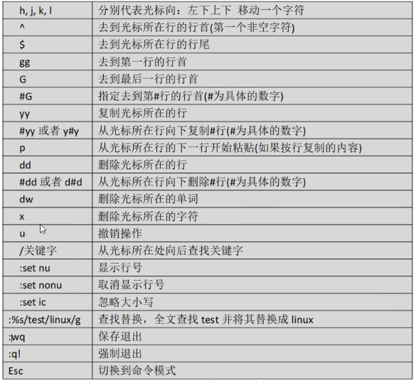

# Linux操作系统

## 虚拟环境

* CentOS 7 Linux操作系统；
* 虚拟机：VMware 17
* 客户端：XShell
* 服务器：CentOS 7版本的Linux；
* 客户端：XShell，Putty，SecureCRT（SSH协议）

## Linux操作系统

* 源于Unix操作系统，开源免费的；版本：RedHat，Ubuntu，CentOS；
* Linux：一切皆命令，一切皆文件。

### 基础概念

普通用户

```
[lan@landev root]$
```

root用户

```
[root@landev ~]#
```

* 切换用户： `su lan`
* pwd：查看当前路径，返回当前的绝对路径
* cd：切换目录，`cd 路径`
* ls：查看路径下的内容;

路径：

* 根路径：`cd  / ` 系统根目录
* 绝对路径：`cd /var/log`
* 相对路径：
* 当前路径：`cd ./`
* 上级路径：`cd ../../`
* 家路径：`cd ~`普通用户家目录/home/harry,  root用户的家目录：/root

辅助：

* history：查看当前会话的历史操作命令
* clear：清空屏幕

## 文件管理

* 文件夹/目录
  * 新建文件夹 `mkdir newDir newDir2 newDir3`可以创建单个或多个目录；
  * 创建层级目录：`mkdir -p db/oracle`
  * 删除目录：`rmdir 目录`
  * 删除层级目录：`rmdir -p db/mongodb/data`删除单层级目录，要求目录下为空
  * 删除目录及文件：`rm -rf dirName`
  * 查看目录：`ls 目录`   `ls -a`   `ls -A`   `ls -l`
* 文本文件
  * 创建文件：`touch fileName`
  * 修改文件：`vim fileName` 非编辑模式 i/a 进入编辑模式，ESC键退出编辑模式；`:wq`保存退出   `:q!`强制退出
  * 删除文件：`rm -rf fielName`
  * 查看文件：`cat/more/less/head/tail fileName`
    * `cat fileName` 一次性查看文本内容
    * `more fileName` 分屏查看文本内容
    * `less fileName` 关键字查找文本内容
    * `head fileName` 查看文本前10行内容
    * `tail -100f fileName` 动态查看最新100行记录
  * 文件复制/剪切
    * 复制： `cp -R 源路径 目标路径` 复制文件夹以及里面的内容要加 -R 参数
    * 剪切：`mv 源路径 目标路径`
  * 文件压缩解压 zip/tar 格式
    * zip压缩：`zip 压缩后文件.zip  源文件1  源文件2`
    * zip解压缩：`unzip fileName.zip`
    * tar压缩：`tar -zcvf fielName.tar.gz 源文件1 源文件2 源文件3`
    * tar解压缩：`tar -zxvf fileName.tar.gz`
  * 文件内容截取 cut
    * 举例：`cut -d ":" -f 1 fileName`
      * -d ":" 内容分割符号为":"
      * -f n 显示分割后内容的列
  * 动态输入文本内容：tee -a fileName
    * 管道（|）:将多个命令进行组合,将前一个命令的输出，作为后一个命令的输入；
    * 和管道（|）一起使用；`cat fileName | tee -a fileName`
  * 根据关键字查找文本：grep
    * `grep -i "keyWord" fileName`
  * vim
    * 
