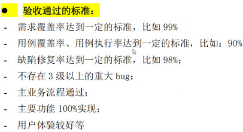
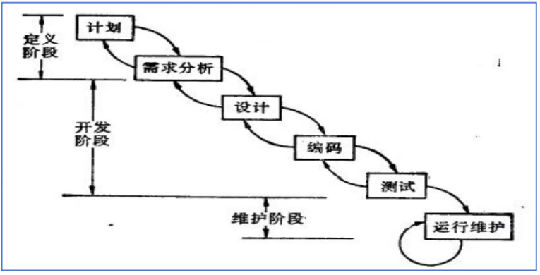
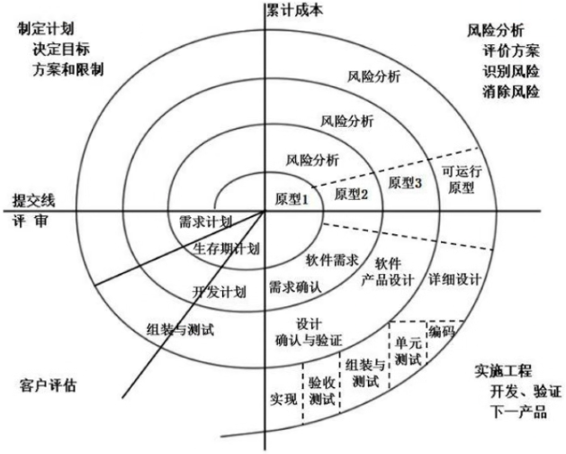
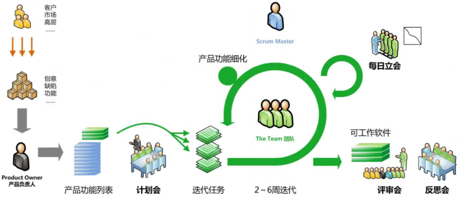
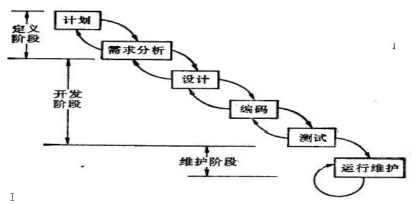
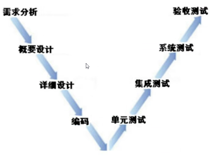
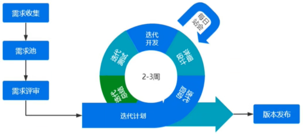

# 软件测试的理论

## 软件测试的概念

* 通过人工或者自动化的技术手段测试系统；判断是否满足规定的需求，是否存在缺陷Bug，对存在的Bug提交开发进
  行修复，弄清楚预期结果和实际结果的区别。
* 软件测试的作用：质量保障、找到Bug、提高软件质量、规避产品中的风险；

## 软件测试的方法

* 测试的内容：黑盒测试、白盒测试、灰盒测试
  * 黑盒测试：不关注软件程序内部代码逻辑的实现，只关注软件产品整体的输入输出实现；功能测试
  * 白盒测试：关注软件代码底层逻辑实现；（单元测试，主要有开发负责）
  * 灰盒测试：既要关注软件的整体的实现，又要关注底层代码的实现；（接口测试）
* 是否执行测试：静态测试、动态测试
  * 静态测试：不运行软件产品，通代码分析，文档评审来判断产品是否存在问题；代码走读，文档评审
  * 动态测试：运行产品的过程发现存在的问题；
* 测试的方法：人工测试、自动化测试
  * 人工测试：手工测试。测试执行通过人工来完成；
  * 自动化测试：通过代码、工具来辅助测试；

## 软件测试过程(阶段)

* 单元测试：测试代码，由开发或测试对构成软件的最小单元函数、方法进行逻辑层面的测试；
* 集成测试：对软件的功能、模块、子系统进行组合测试；接口测试；
* 系统测试：对软件产品本身和运行所需要的环境（软件、硬件、网络、数据、文档、代码、工具）
* 验收测试：软件产品交付用户使用前进行的测试；交付测试（分为α测试和β测试）
  

  * α测试：内部人员在公司内部环境下开展的模拟测试；（内测）
  * β测试（灰度测试）：在正式环境下由部分真实用户开展的公开测试；（公测）
  * α测试和β测试的区别？
  * |        | α测试   | β测试   |
    | :----: | -------- | -------- |
    |  环境  | 模拟环境 | 真实环境 |
    |  人员  | 内部人员 | 真实用户 |
    |  数据  | 模拟数据 | 真实数据 |
    | 可控性 | 可控     | 不可控   |

    
* ### 冒烟测试

  * 概念：快速验证产品是否可测的自由测试方法；由开发转入测试过程的必要环节；在系统测试之前由开发和测试共同参与；
  * 开展过程：
    * 从系统功能测试用例中挑选主要功能、业务流程用例作为冒烟测试用例，占系统测试全部用例的10%左右；（挑选功能的正向测试用例）
    * 进行冒烟测试用例评审；（确保核心功能，主要业务流程的覆盖）
    * 交付测试版本后正式进行冒烟测试执行；（开发测试共同参与）
    * 对冒烟测试结果进行评估；（确定是否通过，不通过，打回开发进行修改；通过，进行正式的系统测试）
  * 冒烟测试通过的标准：
    * 主要业务流程能够进行；
    * 主要重要功能模块要实现；
    * 无重大或致命 bug，影响项目流程;
    * 功能完成率达到80%以上；
    * 冒烟测试用例通过率到达90%以上；
  * 注：实践方法通过打分制来判断是否通过；给每一条标准制定最低分数，及最终的的分数线；
* ### 测试环境

  * 开发环境：用来进行开发自测的环境；进行功能联调、接口对接、单元测试；
  * 测试环境：SIT（系统集成环境），用来进行系统测试、集成测试；
  * 仿真环境：模仿真实环境，进行验收环境；PRE环境（预发布环境）
  * 真实环境：产品交付后运行的环境（生产环境，线上环境）
* ### 回归测试：

  * 对已经修复的Bug再次进行确认；用来验证Bug是否修复，以及是否对其他功能模块产生影响；
  * 回归测试的策略：完全重复测试、选择性重复测试；
    * 完全重复测试：所有用例全面重新执行；不确定Bug所影响的范围，确定Bug所影响的范围很广；
    * 选择性重复测试：覆盖修改法、指标达成法、周边影响法：根据Bug影响的范围确定；
      * 覆盖修复法：只测试Bug本身，确定Bug不对其他模块产生影响；
      * **周边影响法**：测试Bug本身及其所影响的范围；确定Bug可能对个别功能模块产生影响；（推荐使用）
      * 指标达成法：根据团队经验设置指标值（Bug修复率）是否达标，适用团队稳定、经验丰富，流程稳定的项目
* ### 系统测试阶段划分

  * 计划：根据需求文档（需求规格说明书SRS、产品需求文档PRD）、项目计划、开发计划，制定《系统测试计划》；
  * 设计：根据需求文档，《系统测试计划》，指定《系统测试方案》；
  * 实现：根据需求文档，《系统测试计划》，《系统测试方案》，指定《系统测试用例》，《预测试用例》，《测试规程》；
  * 执行：执行系统测试用例，输出《缺陷报告单》，《系统测试报告》；
* ### 测试工作内容：

  * 用例执行：执行已经写好的用例，发现Bug，提交Bug，回归测试；
  * 用例设计：对具体功能进行验证的数据操作集合；灵活应该测试用例设计方法进行设计；覆盖需求；
  * 设计测试计划、方案、撰写测试报告；由测试组长或测试经理完成；
  * 搭建测试环境；测试环境包括：软件系统、硬件设备、数据库、操作系统、配套的工具组成；
  * 需求分析：分析项目业务中可测的需求，明确业务流程；
  * 测试评审：参与测试用例评审、接口代码评审、产品需求评审等；
  * 产品文档的撰写：编写产品用户手册、产品说明书等产品文档，辅助产品经理进行业务培训；
  * APP测试：对APP进行功能测试，稳定性测试、弱网测试、兼容测试等；
  * 接口测试：设计接口测试用例，使用Postman/APIPOST等工具进行接口测试；
  * 自动化测试：编写自动化脚本代码，搭建自动化框架，开展自动化测试；包括：UI自动化、APP自动化、接口自动化；
  * 性能测试：进行性能需求分析，设计性能测试用例，编写性能测试脚本，进行性能压测；
  * 安全测试：使用安全测试工具进行漏洞扫描，分析产品中存在的安全风险；
  * 测试开发：编写测试工具、搭建测试平台，辅助测试工作效能提升；
* ### 质量三要素：人员、工具、过程

  * 只有合适的人员经过合适的过程，借助合适的工具，才能研发出高质量的软件；
  * 人员和过程起主要作用，工具辅助作用；
  * 如何提高软件产品的质量？（围绕质量三要素展开）；
* ### 项目的组织架构

  * 由项目经理（PM）负责，带领开发、测试、产品组；
  * 产品：产品经理PM/PD，负责业务需求的搜集，整理、评审、确定；

    * 需求分析师：分析挖掘业务需求，生成产品需求文档PRD；
    * UI设计师：负责把需求内容可视化，生成原型设计，UI效果图；
  * 开发：开发经理负责Dev，代码实现需求，形成可用的产品；

    * 架构师：负责整体技术选型，框架设计，技术交互等；生成概要设计、详细设计；
    * 前端开发：负责与用户之间交互的UI界面技术实现；
    * 后端开发：负责底层的接口、服务、业务逻辑、工数据库、算法等方面的技术实现；
  * 测试：测试组长负责进行功能测试、接口测试、自动化性能测试等，保障产品质量；

    * 功能测试：负责功能业务的测试，从手工的方式进行用例设计、执行，发现Bug，然后回归测试；
    * 自动化测试：负责代码层面进行脚本编写、框架搭建，测试执行等，提高测试效率；
    * 其他岗位：
      * CMO配置管理：负责产品研发过程中的所有文档、工具、代码、数据等的统一管理；
      * 发布员：负责把软件代码打包发布到指定环境进行运行或测试；
    * 人员比例：
      * 开发 : 测试  =  4-5 : 1
      * 产品 : 测试  =  1 : 2-3
      * 初级 : 中级 : 高级  =  1 : 3-4 : 1
* ### 软件生命周期

  * 一个从无到有的过程：计划、需求分析、设计、编码、测试、运维等6个过程；

    * 计划：项目经理负责：项目的整体构想、项目可行性分析（技术、业务）、组织架构及资源评估、
    * 需求分析：产品经理负责：详细分析产品的业务细节，具体实现的业务逻辑，形成产品需求文档PRD和产品原型设计；
    * 设计：架构师或开发负责：包括概要设计HLD（架构设计，前后端交互，模块之间的交互，数据库的交互），详细设计LLD（模快内功能直接的交互）形成概要设计和详细设计；
    * 编码：开发人员负责：代码实现具体的功能逻辑，接口交互，算法实现等；形成具体可视化，可操作的软件产品功能；
    * 测试：测试人员负责：对已经实现的软件产品进行功能测试、非功能测试；验证产品是否满足需求；形成产品测试用例、缺陷报告、测试报告等；
    * 运维：运维人员负责：对交付使用的在线产品进行日常的运行维护，确保产品能够正常运行；对运行过程中存在的问题进行收集反馈；
  * 在计划 -> 测试的过程中，任何环节出现问题，都可以往前回溯，解决问题后继续推进；
  * 在运维过程中，对搜集到的需求或问题，整理后可以重新制定计划，进行新一轮的生命周期；

  举例说明对软件生命周期的理解？

## 软件研发模型

* 瀑布模型
  * 概念：把软件生命周期，线性流水化的展示；（把生命周期）分成定义 (计划、需求分析)、开发(设计、编码、测试)、维护 (运行维护)
  * 特点：
    * 优点：定义、开发、维护的每一个阶段设置了严格的检查点，确保每个阶段任务完成后才进入下一阶段；
    * 不足：周期时间比较长、过程中存在变化不可逆、不能进行需求变更、成本代价高，最后交付产品，风险比较大；
    * 适用于周期长、需求比较稳定；比如：军工、银行金融类型项目；

      
* 螺旋模型
  * 概念：把一个大的软件产品拆分为若干个小的产品，逐步迭代完成。每一圈都构成了一个小的生命周期，且在原有生命周期的基础上引入了风险分析；
  * 特点：
    * 优点：把大产品拆分为小产品，可以及时看到交付产物；可以进行需求变更。引入风险分析，提高产品的成功率。
    * 不足：风险分析需要有专人来负责，否则风险更大；周期变长，成本更高；交付的是一个中间产物，不可用；
    * 适用于：周期比较长、需要进行需求变更、预算比较充足的项目；比如：科研、创新类型的项目；
  * 
* 敏捷模型
  * 概念：把软件产品分成若干个小产品进行迭代开发，每次迭代交付一个可用的产品；
  * 特点：
    * 优点：迭代交付可用的产品，缩短交付周期，降低研发成本；
    * 不足：迭代频率高，研发压力大，对团队成员要求较高；
  * 

## 测试过程模型

常见的测试模型：瀑布模型、V模型、W模型、敏捷模型；

* 瀑布模型
  * 
  * 特点：按照生命周期的线性流程开展，测试工作在后期介入，起到了质量保障的作用；
  * 不足：测试介入较晚，对前期环节的质量保障作用有限；测试内容不够清晰，无法较好的体现测试价值；
* V模型
  * 
  * 特点：把测试过程划分为单元测试、集成测试、系统测试、验收测试、测试内容比较具体；四个阶段与前期工作建立对应关系，明确测试内容；
  * 不足：测试后期介入，质量保障作用有限；测试过程细分，增加测试的周期和成本；
* W模型（双V模型）
  * 
  * 特点：把单元测试、集成测试、系统测试、验收测试的每个阶段进一步划分为计划、设计、实现、执行，测试更加细化具体；并把计划、设计、实现工作前移，实现与开发同步进行，缩短测试周期，降低研发成本；
  * 不足：整体研发周期较长，测试工作任务较重，质量保障仍然有限
* 敏捷模型
  * 
  * 特点：把大项目拆分成小项目，进行迭代开发测试；缩短研发周期，减少测试的工作量；
  * 不足：每次迭代周期短，任务重，测试压力比较大；

## 系统测试类型

* 功能测试：验证产品是否满足规定的需求（显性需求，隐形需求），是否存在功能遗漏，实现错误，需求是否覆盖完毕。
* GUI测试：验证产品的用户图形界面是否正常；确认页面的排版布局，颜色风格，字体大小，窗口控件，按钮操作等是否协调统一，美观；
* 性能测试：验证产品在高并发量的情况下能否正常使用；确认产品的并发量（比如两千用户同时登陆）、响应时间（1/3/5s原则）、TPS（吞吐率，每秒接受的事务）、CPU资源的利用率（不超过75-80%）、内存利用率（不超过80-85%）等主要性能指标是否满足要求；
  * 压力测试：通过不断增加负载，找到系统所不能承受的极限值；性能指标超过预定的数据,达到不可用的状态;
  * 负载测试：通过测试不同的负载,找到系统能够运行的最佳值;性能指标达到预定的数据,系统运行最好状态;
  * 容量测试：通过增加产品的数据量,判断系统能够正常运行的状态;大数据量测试;
* 兼容测试：验证产品在不同的软件、硬件、网络、数据等环境下能否正常运行；确认产品在不同浏览器（Chrome、FireFox、Safria、Edge），不同操作系统（Win7、Win8、Win10、Win11），不同硬件内存（Intel i3/i5/i7，AMD）不同数据库（MySql，Oracle，SQLServer）等能否正常运行；
* 安全测试：验证产品是否存在数据传输，通信加密，权限访问，网络攻击，数据存储等方面的安全风险；
* 可用性测试：验证产品是否满足用户的体验，容易理解，学习和使用；也叫做易用性测试；
* 异常测试：验证产品在**人为干预**下（人为断网、断电、同时操作等）能否正常处理，是否具备容错、排错和自我恢复能力；
* 安装卸载测试：验证产品能否正常进行安装、卸载、升级，确认安装、卸载前后不存在多余的文件，升级后影响产品的使用；
* 稳定性测试：验证产品在**一定负荷下长时间运行**是否存在信息泄露、数据错乱、系统性能降低等；
* 可靠性测试：验证产品在**规定的条件，规定的时间，处理规定的任务**，是否存在失效的概率；
* 网络测试：验证产品在各种网络环境下能否正常运行，不同网络（WIFI、3G/4G/5G、弱网）之间切换能否正常处理；
* 配置测试：验证产品在不同配置（电脑配置、手机配置）运行环境下能够正常使用；
* 备份测试：验证产品是否能够在不同备份策略（热备份/冷备份，增量备份/完全备份等）正常数据备份和恢复；
* 健壮性测试：验证产品**长时间运行**过程中能否处理突发问题，**自动进行**容错排错和恢复能力；
* 文档测试：验证产品研发过程中的各种文档（需求文档、开发文档、设计文档、测试文档、产品文档等）是否存在错误；

## 软件测试的流程

* 制定测试计划：由测试组长分配测试任务，安排测试时间，制定测试方案；
* 测试需求分析：根据需求文档（SRS/PRD/原型设计），分析需求中可测试的功能矩阵(功能点、测试点、优先级)和业务流程；
* 测试需求评审：由测试组内或项目组内确认需求是否覆盖全面；
* 设计测试用例：根据功能矩阵和业务流程，设计合理的测试用例来覆盖需求；
* 评审测试用例：确定用例的规范，用例设计方法是否合适，测试覆盖率是否全面；
* 冒烟测试：确认系统是否可测；
* 执行测试用例：正式全面的系统测试；
* 缺陷提交跟踪：发现Bug提交给开发进行修复；
* 回归测试：开发修复后再次进行测试确认Bug修复；
* 版本迭代：按照敏捷模式，进行多轮次的版本迭代测试，确保每个版本都能够正常使用；
* 测试报告：对整个系统测试过程进行总结分析，确认产品是否达到交付标准，给出结论建议；
* 验收测试：交付前进行最后的验收测试，确认产品达到交付要求；
* 发布上线：发布到正式的环境下，交付用户使用；

### 测试需求分析

#### 软件需求：软件产品需要满足的特性或者应该具备的功能

* 需求分类：功能需求，非功能需求；显性需求，隐形需求；
  * 功能需求：产品能够实现某一个具体的业务逻辑，或者完成一个具体的任务，达到一个具体的效果；比如：登录，注册，支付，搜索；
  * 非功能需求：除功能需求以外的软件特性；比如：性能，安全，兼容，易用，稳定等；
  * 显性需求：产品明确要求实现的需求；比如：需要进行商品搜索，就应该实现搜索功能；
  * 隐性需求：产品虽然未明确提出但因该实现的需求；比如：搜索使用快捷键回车进行搜索；
* 需求管理方式分
  * 原始需求（客户需求）：由客户提出的需求，比较抽象，不够详细，有一定市场需求；MRD（市场需求）
  * 产品需求：由产品经理根据客户提出的原始需求，进行详细的需求调研，市场分析，挖掘所形成的比较具体的详细的业务需求文档；PRD
  * 软件需求：由产品经理，开发，测试共同评审后形成的可以用例进行软件研发的需求文档；SRS软件需求规格说明书；
  * 测试需求：由测试人员根据SRS/PRD进行分析后形成的用于软件测试的需求文档；

#### 测试需求

* 概念：测试的范围、测试设计、测试方法、测试周期等都可以是测试需求。总归下来，测试需求就是对测试提出的要求的总和；
* 测试需求分析：根据对测试提出的要求，对软件需求文档进行测试分析的过程
* 测试需求分析的产物：功能矩阵，业务流程图；（功能测试）
* 功能矩阵：整理出产品的功能模块，功能点，测试点，优先级
  * 功能模块：若干业务相似的功能所组成的模块；比如：用户管理；
  * 功能点：能够独立完成一件任务，具有一定的业务逻辑判断，伴随着UI交互，数据变化；比如：用户登录，注册；
  * 测试点：验证功能点好坏的各种情况；包括正向的正面功能可用的情况，反向证明功能不可用的情况；比如：用户名密码正确登录、用户不存在登录、密码错误登录等情况；
  * 优先级：分为高、中、低；用来标识测试的先后顺序；优先级高的先测试，优先级低的后测试；
    
* 业务流程：由若干功能操作组成的一条实现项目业务功能的流程；包含：输入、执行和判断；
  * 输入：执行过程中需要传入具体的数据来完成；用平行四边形标识；
  * 执行：具体的操作动作；用矩形来标识
  * 判断：流程中的各分支判断；用棱形标识；
  * 直线、折线：操作过程用有向直线或折线进行连接；
  * 开始/结束：流程的开始和结束用椭圆标识

    举例：用户访问网站进行登录时，若已注册则直接登录，若未注册则跳转至注册，注册时手机号错误需重新注册；登录时登录信息错误，返回重新登录，登录成功跳转至首页；若忘记密码，则跳转至密码找回，找回后可以重新登录；进行修改密码重新登录；
    
  * 画流程图注意事项：

    * 矩形和平行四边形代表操作，平行四边形可以用矩形代替；
    * 矩形和平行四边形都只有一个出口，可以有多个入口；
    * 棱形只有两个出口，可以有多个入口；
    * 相同的输入框或执行框只能出现一次；
    * 画图中直线或折线，只能时单向箭头，尽量避免交叉；
    * 画图时顺序从上往下，从左往右，排版尽量做到横平竖直；
  * 练习：分析微信的5个常用的功能测试点，输出的功能矩阵和3个主要业务流程

面试问题：

1. 软件测试的完整流程；
2. 软件测试模型有哪些；
3. 软件测试过程阶段划分；
4. 软件测试类型有哪些；
5. 冒烟测试如何开展；

## 测试用例设计

## 缺陷管理
